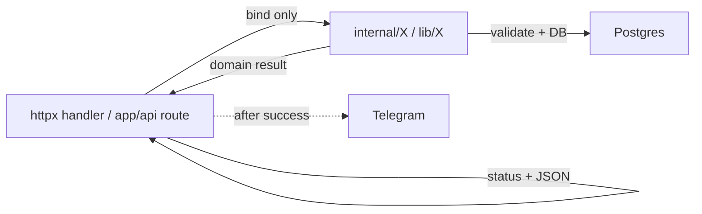

# 双端 API 分层与同构规范

> 日期：2026-08-01  
> 状态：规范已落地；Phase 2–5 实现与验证已完成（2026-08-01）  
> 适用范围：Next（`src/app/api` + `src/lib`）与 Go FC（`fc/internal`）共享后端域

本文件是双端 **强对称** 的硬规范。改 API 实现前先对照本文；新增能力必须同时加两端同名模块 / 函数。

语言原则见根目录 [`AGENTS.md`](../AGENTS.md)：用户可见文案英文；文档与代码注释中文。

---

## 1. 目标与可行性边界

**目标**：同一业务能力在两端有同一分层、同一模块、同一函数职责、同一结构体字段；阅读一端即可预测另一端。

### 1.1 允许的字面差异

| 允许 | 说明 |
|------|------|
| 大小写 | Go 导出 `ParseRecordDraft`；TS `parseRecordDraft`（同一 **stem**） |
| 运行时类型 | Go `error` / `(T, status, error)`；TS 对等的 `{ error, status }` 或现有 Result 联合（**两端选同一种形状**，不用单端专有 Result 库） |
| DB / HTTP 适配器 | `pgx` vs Drizzle；`http.Request` vs `NextRequest` — **只出现在适配边界**，不进纯逻辑 |
| 前端专用 | `prefs` / `datetime-ui` / `api-client` 仅 TS，**不进**对照表 |
| **404 / 405 形态** | Go FC（`withJSONErrorPages`）统一 `{ "error": "…" }` JSON；Next 未导出的 method / 未知 `/api/*` 仍用 **框架默认**（常非业务 JSON）。业务路径的 4xx/5xx 仍两端 `{error}` 对齐 |
| **CORS / OPTIONS** | 仅 Go `withCORS`：跨域 Accelerate 需要预检 204、不鉴权；Next 同源 Vercel **不加** CORS，OPTIONS 也走 proxy 鉴权 → 401。属部署拓扑差异，非业务契约 |
| **小数长度计数** | Next `string.length`（UTF-16）；Go `utf8.RuneCountInString`。`DECIMAL_STRING` 仅 ASCII，合法字面量下二者相等；非法非 ASCII 会先被正则拒 |

### 1.2 刻意不做的单端高级特性

- 不为 Go 单独上复杂泛型仓储；不为 TS 单独上装饰器或 class service
- 两端都用：**包级函数 + 普通 struct/type**，不用 class 作为业务载体
- SQL / Drizzle 写法保持「笨」、可逐行对照；rename 全表扫描等低效实现先对称

### 1.3 不追求

标识符字符串跨语言完全相同——只追求 **stem 相同 + 语言惯用大小写**。

---

## 2. 分层与禁令

| 层 | 职责 | 禁止 |
|----|------|------|
| **HTTP**（`fc/internal/httpx`、`src/app/api/**/route.ts`） | 绑定请求、调用 lib、映射 HTTP status、写 JSON、成功后 Telegram | **业务 SQL** / 业务校验编排（保留鉴权、CORS、框架绑定） |
| **lib / internal**（`src/lib/X`、`fc/internal/X`） | 校验、纯变换、DB 编排 | 直接写 HTTP 响应；在纯逻辑里依赖具体 HTTP 类型（适配器边界除外） |
| **db**（`fc/internal/db`、Drizzle schema） | 连接与表定义 | 业务规则 |

### 2.1 硬禁令

1. **禁止** `src/app/api/**/route.ts` 与 `fc/internal/httpx/server.go` 出现 **业务 SQL**（含内联 Drizzle `insert` / `update` / `select` 编排与 Go 裸 SQL）。例外：测试代码；`fc/internal/db` 连接辅助。
2. **禁止** 只改一端：共享后端新能力必须同时加两端同名模块 / 函数，并先更新本文对照表。
3. **禁止** 静默单端性能优化导致对称破缺（见 §8）。
4. **Telegram 留在 HTTP 层**：INSERT / 批处理成功后由 handler best-effort 通知；不把 Telegram 调用塞进 `logapi` / `record` 的 DB 函数里。

### 2.2 已消除的偏差

以下偏差已在 Phase 2–5 落地，两端同构，**不再是缺口**：

- TS：`src/app/api/log/*`、rename/patch、query summary/tags 的业务 Drizzle 已抽到 `src/lib`（`logapi` / `tags` / `record` / `query`），与 Go 同构。
- Go：`server.go` 业务 SQL 已抽到 `tags` / `record` / `query` / `logapi`。
- 交易纯解析在 `transactiondraft`（两端独立模块）。

---

## 3. 同构规则

1. **同 stem**：`CreateNumber` ↔ `createNumber`；`RenameAcrossRecords` ↔ `renameAcrossRecords`；`FetchFilteredRecords` ↔ `fetchFilteredRecords`。
2. **同参数语义顺序**：Go 为 `(ctx, db, …)`；TS 用模块内默认 `db`，其余参数顺序与 Go 去掉 `ctx` / pool 后一致。写库路径：`RenameAcrossRecords` 接受 `*pgxpool.Pool`（内开事务 + `pg_advisory_xact_lock`）；TS `renameAcrossRecords` 生产同语义，可选末参 `store` 注入同构边界供单测（无真实锁）。`Update` 等仍可用 `db.Querier`。
3. **同结构体字段名**：JSON / API 已是 camelCase；内部 DTO 字段名两端相同（Go struct tag 与 TS type 对齐）。API 记录类型两端都叫 **`Record`**（TS 已收敛原 `ApiRecord` / `TwinRecord` 到共享后端域的 `Record`；前端 `api-client` 可再导出别名）。
4. **同错误文案**：用户可见英文错误字符串必须字节级一致（契约测继续守）。
5. **先表后码**：本轮新建 / 迁移的符号必须先写入本文对照表再实现；禁止「Go 叫 `Update`、TS 叫 `updateRecord`」这类不对齐命名。
6. **包级函数 + 普通类型**：不用 class 承载业务。

---

## 4. 完整模块对照表

共享后端域必须 1:1。历史命名本轮收到同一 stem：

| Stem | Go | TS | 备注 |
|------|----|----|------|
| `tags` | `fc/internal/tags` | `src/lib/tags.ts` | 已有；含 `RenameAcrossRecords` |
| `draft` | `fc/internal/draft` | `src/lib/draft.ts` | TS 已由 `record-draft.ts` 改名 |
| `transactiondraft` | `fc/internal/transactiondraft` | `src/lib/transactiondraft.ts` | **独立成包**（已落地）；TS 已由 `transaction-draft.ts` 改名；Go 已从 `logapi` 抽出纯解析 |
| `query` | `fc/internal/query` | `src/lib/query.ts` | TS 已由 `query-records.ts` 改名 |
| `logapi` | `fc/internal/logapi` | `src/lib/logapi.ts` | TS 已新建；勿用 `log-api`；只保留创建 + SQL，解析委托 `draft` / `transactiondraft` |
| `record` | `fc/internal/record` | `src/lib/record.ts` | TS 已合并原 `record-json.ts`；含 `Update` / `FromDB` / `TagsJSON` / type `Record` |
| `telegram` | `fc/internal/telegram` | `src/lib/telegram.ts` | 导出名已对齐同 stem；由 HTTP 调用 |
| `timeutil` | `fc/internal/timeutil` | `src/lib/timeutil.ts` | TS 已由 `time.ts` 改名 |
| `auth` | `fc/internal/auth` | `src/lib/auth.ts` | 已有 |
| `httpx` | `fc/internal/httpx` | `src/app/api/**/route.ts` | 框架层，**不要求**文件同名 |
| `db` | `fc/internal/db`（含可注入 `Querier`） | Drizzle schema（现有路径）；写库函数可选末参 `store` | 连接 / 表；非业务编排 |

**不进对照表（仅 TS 前端）**：`prefs`、`datetime-ui`、`api-client`。

**`transactiondraft` 独立**：不得把交易 batch 纯解析长期留在 `logapi`；`logapi` 只做 create + SQL，调用 `transactiondraft.ParseTransactionBatch` / `parseTransactionBatch`。

---

## 5. 关键函数 / 类型对照

### 5.1 本轮已抽取 / 对齐（已落地）

| Stem | Go | TS |
|------|----|----|
| logapi | `CreateNumber` / `CreateText` / `CreateTransactionBatch` | `createNumber` / `createText` / `createTransactionBatch` |
| transactiondraft | `ParseTransactionBatch`（及同包输入 / 归一化类型） | `parseTransactionBatch` |
| tags | `RenameAcrossRecords` / `ValidateRename` | `renameAcrossRecords`（`tagsdb`）/ `validateRename`（`tags`） |
| record | `Update` | `update` |
| record | `FromDB` / `TagsJSON` / type `Record` | `fromDB` / `tagsJSON` / type `Record`（已取代 `toApiRecord` / `ApiRecord`，或薄包装同名） |
| record | `FormatHappenedAt` | `formatHappenedAt`（与现有 UTC Z 语义对齐；已收敛 `formatHappenedAtUtc`） |
| record | `IsValidID` / `InvalidID` | `isValidRecordId` / `INVALID_RECORD_ID` |

### 5.2 同构样板（保持 / 微调 stem）

| Stem | Go | TS |
|------|----|----|
| draft | `ParseRecordDraft` / `ParseRecordDraftJSON` | `parseRecordDraft`（JSON 入口按需同名） |
| draft | `EmptyStringToNull` / `ParseHappenedAt` / `ValidateDecimalString` / `ParseValueNumber` | `emptyStringToNull` / `parseHappenedAt` / `validateDecimalString` / `parseValueNumber` |
| tags | `IsValidTag` / `IsReservedTag` / `ValidateTags` / `AssertNoReservedTags` / `ValidateRename` / `RenameTagInTagsJSON` / `AggregateTagCounts` / `RenameAcrossRecords` | `isValidTag` / … / `aggregateTagCounts`（`@/lib/tags`，可进 Client）；`renameAcrossRecords`（`@/lib/tagsdb`，仅服务端，避免 Client 打进 postgres） |
| tags | `ValidationResult{Valid, Error}` | `ValidationResult{ valid, error? }`（`assertNoReservedTags` / `validateTags` / `validateRename` 共用） |
| tags | 脏 `tags` JSON：`AggregateTagCounts` / `RenameTagInTagsJSON`（及 `RenameAcrossRecords`）解析失败或根非数组 → **error**（HTTP 500） | 同左：抛错 / 向上失败，**禁止**静默 skip |
| query | `ParseRecordQueryParams` / `FetchFilteredRecords` / `FetchSummary` / `FetchTagCounts` / `EscapeLikePattern` | `parseRecordQueryParams` / `fetchFilteredRecords` / `fetchSummary` / `fetchTagCounts` / `escapeLikePattern` |
| query | `FetchFilteredRecords` 在 lib 内 `FromDB`，返回 `[]Record`（HTTP 不再 map） | `fetchFilteredRecords` 在 lib 内 `fromDB`，返回 `Record[]` |
| timeutil | `IsValidTimeZone` / `GetZonedDayBounds` / `CalendarDayBounds` / `ExpandCompactOffset` / `ParseRFC3339Flexible` | `isValidTimeZone` / `getZonedDayBounds` / `calendarDayBounds` / `expandCompactOffset` / `parseRFC3339Flexible` |
| auth | `VerifyAPIAccess` / `VerifyAdminAccess` / `BearerToken` | `verifyApiAccess` / `verifyAdminAccess`（Bearer 适配器可保留框架差异） |
| telegram | `LoadConfig` / `ConfigError` / `FormatRecordMessage` / `FormatTransactionBatchMessage` / `SendMessage` | 同 stem：`loadConfig`、`configError`、`formatRecordMessage`、`formatTransactionBatchMessage`、`sendTelegramMessage` |
| qqbot | `LoadConfig` / `ConfigError` / `SendMessage` / `Configured` | 同 stem：`loadConfig`、`configError`、`sendQqMessage`、`isConfigured` |
| notify | `ShouldSkipNotifyInTest` / `NotifyUser` / `NotifyRecordInserted` / `NotifyTransactionBatchInserted` | 同 stem：`shouldSkipNotifyInTest`、`notify_user`、`notifyRecordInserted`、`notifyTransactionBatchInserted` |

后续若发现表内遗漏符号，**先改本文再改代码**。

---

## 6. 错误返回形状

两端业务函数对「可映射为 HTTP」的失败采用 **同构形状**（偏现有 `logapi`）：

| | Go | TS |
|--|----|----|
| 成功带实体 | `(Record, status, nil)` 或 `(n, []Record, status, nil)` | `{ record, status }` / `{ inserted, records, status }` 等与 Go 字段语义对齐 |
| 失败 | `(_, status, err)`，`err.Error()` 为用户可见英文 | `{ error: string, status: number }`（或等价联合，**两端字段语义一致**） |
| HTTP 层 | 只读 status + error 字符串写 JSON；不改写业务文案 | 同左 |

约束：

- 用户可见 `error` 字符串与 OpenAPI / 契约 fixtures **字节级一致**
- 不引入仅一端使用的 Result 库或错误码枚举体系（除非双端同时引入并写入本文）
- **请求 body 上限**：双端写路径均为 **256 KiB**（`MAX_HTTP_BODY_BYTES` / `httpx.MaxBodyBytes`）。超限 → **413** + `Request body too large`（禁止静默截断后再当残缺 JSON）。

---

## 7. 通知与 HTTP

- 通知触发点：**HTTP handler**，在 lib 返回成功之后，经统一入口 `notify`（`NotifyUser` / `notify_user`）。
- `telegram` / `qqbot` 仅为渠道（配置、发送；TG 另含排版）；probe 走各渠道 `SendMessage`，**不**经 `notify`。
- **不**在 `CreateNumber` 等 DB 函数内部发送。
- 失败 best-effort：不影响已成功写入的 HTTP 状态码（与现行为一致）。
- **不阻塞写响应**：Next 用 `after()`（无 request scope 时退化为 fire-and-forget）；Go 用 `go` 协程。客户端 HTTP 超时两端均为 **15s**（Next `AbortSignal.timeout` / Go `http.Client.Timeout`）。

---

## 8. 性能导致对称破缺的流程

默认：**先对称，后破缺**。

若某端因性能必须偏离（例如 rename 不再全表扫描）：

1. 开议题说明动机、拟议双端最终形态、临时是否允许单端先行。
2. **双端**在本文或同目录短备注中记录破缺点与恢复对称的计划。
3. **禁止**静默只改一端 SQL / 算法而不更新文档与对照端。

在破缺获批并文档化之前，两端保持可逐行对照的「笨」实现。

---

## 9. 与 OpenAPI / 测试的关系

- **不**借分层重构修改对外 HTTP 契约与鉴权语义。
- 改实现后仍跑：`npm test`、`cd fc && go test ./...`、`npm run test:openapi`、`cd fc && go test ./internal/contract/`。
- 抽检：`src/app/api` 与 `fc/internal/httpx/server.go` 无业务 SQL。

---

## 10. 变更检查清单（给实现代理）

以下为**后续变更**自检模板，非本轮未完成项（本轮同构落地已核；Phase 2–5 / P1 / DB mock 已完成）。

- [ ] 对照表已包含新符号（先改本文）
- [ ] Go `fc/internal/<stem>` 与 TS `src/lib/<stem>.ts` 同时存在
- [ ] 函数 stem / 字段名 / 错误文案对齐
- [ ] HTTP 层无业务 SQL；Telegram 仅在成功后由 HTTP 调用
- [ ] 契约测与双端单测通过
