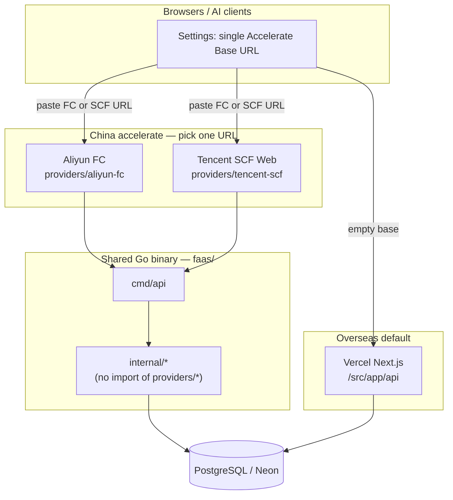
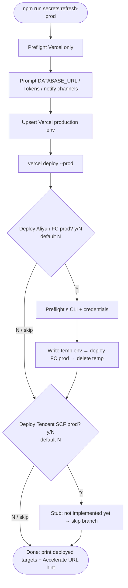

# DigitalTwin2026：多云 FaaS 国内加速（FC + SCF）

> 创建日期：2026-08-02  
> 状态：讨论定稿 + Task 1–3 已落地；**Task 4 SCF**：部署工具已定为 **Serverless Cloud Framework**（`scf`），实现仍待做  
> 性质：架构讨论；永久双云（阿里云 FC **保留** + 腾讯云 SCF **新增**）  
> 相关：[`faas/providers/aliyun-fc/README.md`](../faas/providers/aliyun-fc/README.md)、[`AGENTS.md`](../AGENTS.md)、[`docs/20260801-api-layering.md`](20260801-api-layering.md)；SCF 工具文档：https://cloud.tencent.com/document/product/1154/50938；双云 test 延迟对比（`POST /api/db/probe` 专用连接 + `GET /api/query/transaction/summary` 池复用，含墙钟）见 [`docs/20260802-db-probe-multi-cloud.md`](20260802-db-probe-multi-cloud.md)。

## 0. 目标与非目标

**目标**

- 在**不删除**现有阿里云 FC 配置与能力的前提下，增加腾讯云 SCF（Web 函数）作为可选国内加速入口。
- 将共享 Go API 与各云厂商部署壳分离：`faas/` 放业务二进制；`faas/providers/<id>/` 放厂商清单、env、部署脚本。
- 调整 `npm run secrets:refresh-prod` 的交互：Vercel **必做**；各云 FaaS **默认跳过**，仅在用户确认后才预检 CLI 并部署。
- 客户端继续只粘贴**一条** Accelerate Base URL（FC 或 SCF 任一）；对厂商无感。
- 为日后再加第三方云预留 `providers/<id>/` 扩展点。

**非目标（本篇定稿时不实施；部分已由后续 Task 落地）**

- ~~**不**移动 / 重命名现有 `fc/` 目录~~ → **已完成**：`faas/` + `providers/aliyun-fc/`。
- ~~**不**改 `scripts/refresh-prod-env.ts`~~ → **已完成**（§4 UX）。
- **不**实现腾讯云 SCF provider 全套（仍属 Task 4；工具链已定为 Serverless Cloud Framework）。
- **不**改客户端 prefs / Settings UI 契约（仍是单一 Base URL 字符串）。
- **不**新增「向阿里云 / 腾讯云自动部署」的 CI job（今天本来就没有）。

---

## 1. 现状摘要

| 项 | 今天 |
|----|------|
| 海外默认 API | Vercel（Next `src/app/api`） |
| 国内加速 | 阿里云 FC3（`faas/providers/aliyun-fc`，Serverless Devs `s.yaml`，custom runtime，端口 **9000**）；腾讯云 SCF **规划中** |
| 共享库 | Neon / 标准 PostgreSQL；test / prod 与 Vercel 对齐 |
| 生产密钥脚本 | `npm run secrets:refresh-prod`：Vercel **必做**；`Deploy Aliyun FC prod? [y/N]` / `Deploy Tencent SCF prod? [y/N]` **默认 N**；各云 CLI 预检仅在选 Y 后 |
| CI / 自动化 | **没有**向阿里云 FC 部署的 CI；仅对 `fc/` 跑 `go test`。prefs / api-client 测试里的 `*.fcapp.run` **只是** URL 字符串样例，不触发部署 |
| 客户端 | Settings → **API Accelerate URL**（prefs）；空 = 同源 Vercel |

**为何加 SCF 仍保留 FC**

- FC 按量计费、空闲缩到 0 时费用接近零；删除无收益、增加回滚成本。
- 双云可对比延迟 / 出网 / 配额；某一云故障时可改粘贴另一条 Base URL。
- **永久双云**是拍板结论，不是过渡态。

---

## 2. 架构总览



要点：

- **业务同构**：Next 与 Go 仍按 [`docs/20260801-api-layering.md`](20260801-api-layering.md) 双端对齐；多云只改变 **Go 的部署壳**，不改变 HTTP 契约。
- **共享代码禁依赖厂商**：`faas/internal`、`faas/cmd` **不得** `import` `providers/*`；厂商差异只在部署清单、env 注入、CLI 包装。
- **客户端厂商无关**：只认 HTTPS Base URL；不区分 `fcapp.run` / SCF 域名形态。

---

## 3. 目标目录树（文档约定；代码搬迁属后续 Task）

```text
faas/
  cmd/api/                 # 现有 fc/cmd/api 迁入
  internal/                # 现有 fc/internal 迁入
  go.mod                   # 现有 fc/go.mod 迁入（module path 另议）
  providers/
    aliyun-fc/             # 迁入现有 s.yaml / env 模板 / deploy 脚本
      s.yaml
      env.fc.example       # 或统一命名 env.example（实现时定）
      scripts/
        deploy.ts
        deploy.sh
        info.sh
        …
    tencent-scf/           # 新建：Serverless Cloud Framework（`scf`）
      serverless.yml       # type: web + CustomRuntime
      scf_bootstrap        # 或构建时生成
      env.scf.example
      scripts/
        deploy.ts          # 预编译 faas/cmd/api → scf deploy（丢弃敏感输出）
        info.sh
    # future vendors...
      # providers/<id>/
```

| 规则 | 说明 |
|------|------|
| 共享 vs 厂商 | `cmd/` + `internal/` = 标准 HTTP 服务；`providers/<id>/` = 仅该云的 IaC / CLI / 密钥文件约定 |
| 二进制语义 | SCF Web **lift-and-shift**：同一 Go 入口、同一路由与鉴权；监听 **`PORT=9000`**（与今日 FC `customRuntimeConfig.port` 一致） |
| 扩展 | 新厂商 = 新目录 `providers/<id>/` + refresh-prod 多问一句 `[y/N]`；**不**改共享业务包 |
| 文档同步 | 搬迁后更新 `AGENTS.md`、根 `README.md`、原 `fc/README.md` → `faas/` / `providers/aliyun-fc/` 说明（后续 Task） |

---

## 4. `secrets:refresh-prod` 交互（已实现）

### 4.1 旧行为（已改掉）

1. 脚本启动即 **强制** `preflightVercel()` + **`preflightS()`（阿里云 `s`）**。  
2. 收集密钥与通知渠道后，**无条件**写临时 `.env.fc.prod` 并部署 **FC prod**，再 `vercel deploy --prod`。  
3. 用户无法「只刷 Vercel、不碰 FC」。

### 4.2 当前 UX（已拍板并落地于 `scripts/refresh-prod-env.ts`）

| 步骤 | 提示 / 行为 | 默认 |
|------|-------------|------|
| 0 | **仅** Vercel 登录 / link 预检（`vercel whoami`、`.vercel/project.json`） | 必做 |
| 1 | 收集 `DATABASE_URL` / Tokens / 通知渠道（语义不变） | 必做 |
| 2 | Upsert Vercel **production** env + **`vercel deploy --prod`** | 必做 |
| 3 | `Deploy Aliyun FC prod? [y/N]` | **N** |
| 4 | `Deploy Tencent SCF prod? [y/N]` | **N** |

规则：

- **逐云询问 → 仅 yes 才部署；N / 回车 = 跳过，不部署。**
- **各云 CLI 预检只在该云选择 Y 之后执行**（例如选了 FC 才跑 `s` / `s config` / `s info`）。**禁止**在脚本开头强制要求已安装阿里云 `s`。
- 跳过某云时：不写该云临时 env、不调用该云 deploy、不因缺少该云 CLI 而失败。
- 选 Y 失败（预检或部署）：`exit 1`；**不**自动回滚已完成的 Vercel 步骤。
- SCF：在 provider 未就绪前选 Y 时打印「尚未实现」英文说明并**跳过该分支**（不 fail 整脚本）。

### 4.3 流程（mermaid）



### 4.4 与测试 / CI 的关系（避免误解）

- 仓库内**不存在**「默认会部署到阿里云 FC」的自动化测试或 CI job。  
- 现有相关测试：`cd faas && go test ./...`；prefs / api-client 用 `https://example.fcapp.run` 等**字符串**测 trim / normalize；`scripts/refresh-prod-env.test.ts` 覆盖默认 N 的 `cloudDeployDecision` 与提示文案。  
- 把 FC 部署改为 **默认 off**，影响面是：**交互脚本 + 文档**，**不是**去关掉一批不存在的「部署测试」。

---

## 5. SCF 接入约定

| 项 | 约定 |
|----|------|
| 形态 | **SCF Web 函数**（`type: web`），HTTP 直出；与 FC custom runtime 同属「标准 HTTP 进程」模型 |
| **部署工具** | 全局安装 [`serverless-cloud-framework`](https://cloud.tencent.com/document/product/1154/50938)（`npm i -g serverless-cloud-framework`）；CLI 简写 **`scf`**（`scf deploy` / `scf info`）。厂商登录可用微信扫码（文档快速入门）或 `.env` 凭证；**AK 与函数 URL 禁止进 git** |
| 配置 | `faas/providers/tencent-scf/serverless.yml`（及 env 模板 / deploy 包装脚本）；`component: scf`，`inputs.type: web`，`runtime: CustomRuntime`（或平台等价自定义运行时） |
| 启动 | 构建 linux/amd64 二进制 + **`scf_bootstrap`**（启动 `./bootstrap` 或等价，监听 **9000**）；与 [Web 函数 bootstrap](https://cloud.tencent.com/document/product/583/56144) 模型对齐 |
| 二进制 | 同一 `faas/cmd/api` 构建产物语义（`GOOS=linux GOARCH=amd64 CGO_ENABLED=0`，trimpath/`-s -w` 等由 provider 脚本决定） |
| 端口 | **9000**（`PORT=9000`）；与今日 FC 一致 |
| 环境变量 | 与 FC 同名键：`DATABASE_URL`、Tokens、Telegram / QQ Bot 等 |
| 鉴权 / 路由 | 与 Next / FC **契约一致**（OpenAPI + 双端测试仍是真源） |
| URL | `scf deploy` / `scf info` 得到的 HTTPS Base URL 粘到 Settings；**禁止进 git** |
| 密钥与 refresh-prod | 选 Y 部署 SCF 时：预检本机已安装 `scf`（或 `serverless-cloud-framework`）；部署前注入 env（勿把 `scf deploy` 明文密钥打到终端，对齐阿里云「禁裸 deploy」精神） |

说明：官方快速入门模板多为事件函数 / Node；本仓库 **不用** `scf-nodejs` helloworld，而是自管 `serverless.yml` + 预编译 Go Web 包，仅复用 **SCF CLI / 登录 / 组件发布链路**。

---

## 6. 成本与规格

| 云 | 目标档位 | 备注 |
|----|----------|------|
| **阿里云 FC** | **保持** 现状省钱档：`memorySize: 128`、`cpu: 0.05`、`diskSize: 512`、`timeout: 30`、`instanceConcurrency: 1`、`minInstances: 0`、`reservedConcurrency: 1` | 空闲 ≈ 免费；按量 |
| **腾讯云 SCF** | 起步对齐平台允许的**低规格**（约 **64MB** 等价档，以实现时控制台 / CLI 最低可选项为准） | **部署后由用户实测确认是否可再降**；本篇不锁死最终 MB 数 |
| 共同 | 禁止无必要的预留常驻 / 高并发；个人项目优先最低可用 | 双云并存时，未部署的一侧无费用；已部署且缩 0 的一侧接近零 |

---

## 7. 风险与缓解

| 风险 | 说明 | 缓解方向（实现时） |
|------|------|-------------------|
| **Neon 延迟** | 国内 FaaS → 海外 Neon 仍有 RTT；换 SCF **不 magically** 解决 DB 延迟 | 接受加速「API 边缘」；日后若迁国内 PG 再评估；测试库 / 生产库勿混 |
| **Telegram 出网** | FC / SCF 出网策略、对 `api.telegram.org` 的连通性可能不同 | 部署前探测（沿用今日 sendMessage / QQ C2C）；失败则该渠道留空或修网络，勿静默 |
| **SCF 响应流量 / CLS** | 出站响应计费、日志服务（CLS）可能产生费用 | 起步最低规格；控制日志级别与保留；部署后看一波账单再调 |
| 双云配置漂移 | 两套 provider 的 env / 超时不一致 | refresh-prod 共用同一组已收集的 values；文档要求键名对齐 |
| 操作者只装一云 CLI | 开头强制 `s` 会误伤「只要 Vercel / 只要 SCF」 | **已拍板**：分云预检 |

---

## 8. 客户端与文档面

- Settings 文案可继续举例 `*.fcapp.run`；实现 SCF 后可**顺带**加一条 SCF 域名示例（可选，不阻塞）。  
- `apiAccelerateBase` **不**增加 `provider` 字段；粘贴谁就用谁。  
- `AGENTS.md` 中「API Accelerate URL 指向 FC」日后改为「指向任一国内 FaaS Base URL（FC 或 SCF）」——属文档后续 Task，本篇先定语义。

---

## 9. 后续实现清单（供 Parent Task 2+；本篇不执行）

**Task 顺序建议（可拆 PR）：**

1. ~~**目录搬迁**：`fc/` → `faas/` + `providers/aliyun-fc/`~~ **已完成**。  
2. ~~**refresh-prod UX**：Vercel 必做；FC / SCF 分问默认 N；CLI 预检推迟到对应 Y~~ **已完成**。  
3. **腾讯云 SCF Web**：新建 `providers/tencent-scf/`；构建同二进制；端口 9000；prod/test 命名与密钥文件约定；本地/手动部署手册。  
4. **验收**：同一 OpenAPI 契约；`go test`；手动对 SCF Base URL 打几条 API；对比 Neon / Telegram 行为；用户确认 SCF 内存档。  
5. **（可选）** Settings placeholder / 开发日志补一句双云说明。

**明确不在本清单内：**

- 改 `docs/20260802-todo-feature.md`  
- 为本迁移新增「部署到云」的 CI  

---

## 10. 已拍板清单（讨论结论）

1. **永久双云**：保留全部阿里云 FC 配置与能力；另增独立 provider 目录；**不删除** FC（按量、空闲 ≈ 免费）。  
2. **目标布局**：`faas/{cmd,internal,go.mod}` + `faas/providers/aliyun-fc/` + `faas/providers/tencent-scf/`（及未来 `providers/<id>/`）；共享代码**不得** import `providers/*`。  
3. **`secrets:refresh-prod`**：Vercel **必做**；阿里云 FC **`Deploy Aliyun FC prod? [y/N]` 默认 N**；腾讯云 SCF **`Deploy Tencent SCF prod? [y/N]` 默认 N**；逐云询问，仅 yes 部署；**各云 CLI 预检仅在该云部署前**（已落地）。  
4. **SCF**：Web 函数 lift-and-shift；同一 Go 二进制语义；端口 **9000**；部署工具 **`npm i -g serverless-cloud-framework`（CLI `scf`）**，见 §5 与 [官方快速部署](https://cloud.tencent.com/document/product/1154/50938)。  
5. **成本**：FC 保持 128MB / min0 / reservedConcurrency 1；SCF 从约 64MB 等价档起，**部署后用户确认**能否更低。  
6. **扩展**：更多厂商只加 `providers/<id>/` + refresh-prod 多一问。  
7. **测试真相**：今日**无** CI/自动化部署阿里云 FC；仅有 `go test` 与 prefs 中的 URL 字符串样例。默认 off **不等于**关闭不存在的部署测试。  
8. **客户端**：单条 Accelerate Base URL；厂商无关。  
9. **交付进度**：目录搬迁 + refresh-prod UX 已落地；SCF **工具链已定**，完整 `providers/tencent-scf` 仍属 Task 4；**不**改动 `docs/20260802-todo-feature.md`。  
10. **风险记账**：Neon 延迟、Telegram 出网、SCF 响应流量 / CLS —— 见 §7。

---

## 11. 开放小项（不阻塞定稿，实现前可再收）

- SCF **地域**默认 **`ap-guangzhou`**（`faas/providers/tencent-scf/serverless.yml`）；可改。  
- 登录：`cd faas/providers/tencent-scf && scf login` → 终端打印 `https://slslogin.qcloud.com/…`（或微信扫码）。  
- SCF 最低 memory（64 vs 128）以首次部署后实测为准。  
- refresh-prod 自动调用 `deploy.ts prod` 的接线仍待完成（骨架 + 手动 deploy 已可用）。  
- Settings UI 是否补充 SCF URL 示例文案（纯文档/文案，非契约变更）。